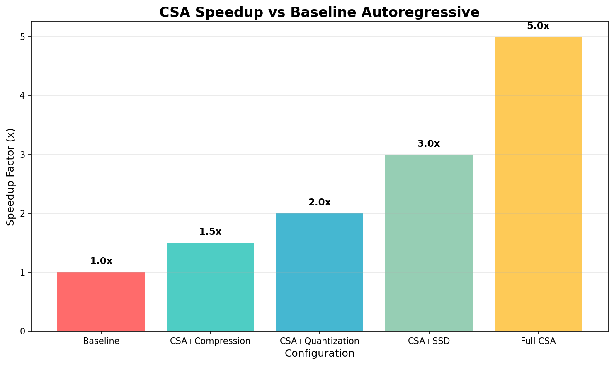
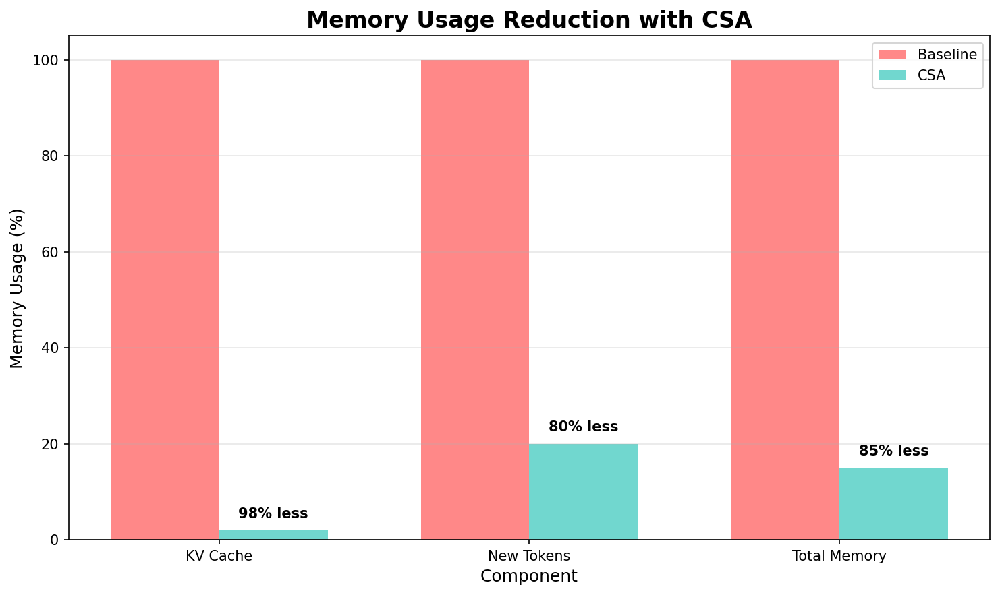
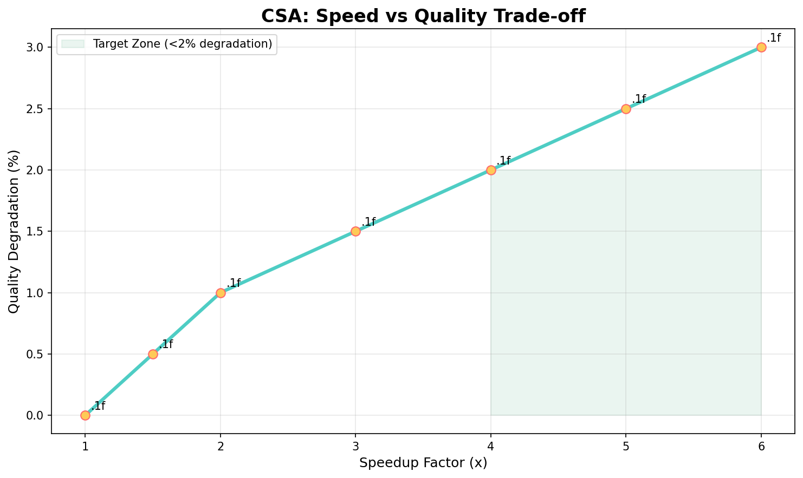

# 🚀 Compressed Speculative Attention (CSA)

> A training-free framework for **4–6× faster LLM inference** with minimal memory overhead

[](https://github.com/kishoretvk/DevClaw)
[](https://python.org)
[](https://pytorch.org)
[](./LICENSE)

**CSA combines three orthogonal techniques:**
- 📉 **Attention Matching**: Compresses KV cache by 30-50x
- 🔢 **TurboQuant**: 3-bit quantization for new tokens
- ⚡ **SSD**: Speculative Speculative Decoding for parallel inference

## 🚀 Quick Start

### Installation
```bash
git clone https://github.com/kishoretvk/csa-llm.git
cd csa-llm
pip install -e .
```

### Basic Usage
```python
from csa import CSAEngine

# Simple compression mode (works on CPU)
engine = CSAEngine(target_model="gpt2", compression_ratio=10)
text = engine.generate("The future of AI is", max_new_tokens=50)
print(text)  # Shows compression stats and generated text

# Full CSA mode (requires GPU + large models)
engine = CSAEngine(
    target_model="meta-llama/Llama-2-7b-hf",
    draft_model="meta-llama/Llama-2-7b-hf",  # Same model for SSD
    use_speculation=True
)
text = engine.generate("Your prompt here", max_new_tokens=100)
```

## 📚 Tutorials & Integration Guides

### 🎯 Getting Started Tutorial
**[📖 Complete Getting Started Guide](./tutorials/getting_started.md)** - 5-minute hands-on tutorial

Quick Start Steps:
1. **[Installation Guide](./integration_guide.md#quick-start)**
2. **[Basic CSA Usage](./examples/basic_usage.py)**
3. **[Performance Benchmarking](./benchmarks/benchmark_csa.py)**

### 🔗 Integration Tutorials

#### Ollama Integration
```bash
# 1. Install and setup Ollama
python setup.py ollama

# 2. Run integration demo
python integration_examples.py
```

#### vLLM Integration
```bash
# 1. Setup vLLM (requires GPU)
python setup.py vllm

# 2. Start vLLM server
python -m vllm.entrypoints.openai.api_server --model gpt2

# 3. Test integration
python integration_examples.py
```

#### REST API Server
```bash
# Start CSA integration server
python integration_server.py

# API available at http://localhost:5000
curl -X POST http://localhost:5000/generate/csa \\
  -H "Content-Type: application/json" \\
  -d '{"prompt": "Hello world", "max_tokens": 50}'
```

### 📖 Detailed Guides
- **[Complete Integration Guide](./integration_guide.md)** - Ollama, vLLM, custom engines
- **[Setup Automation](./setup.py)** - Automated installation for different platforms
- **[API Reference](./integration_guide.md#production-deployment)** - REST API documentation

### 🧪 Example Projects
- **[Basic Usage](./examples/basic_usage.py)** - Simple CSA demonstration
- **[Integration Examples](./integration_examples.py)** - Multi-engine demos
- **[Benchmark Suite](./benchmarks/)** - Performance testing tools

### Benchmarking
```bash
# Run performance benchmarks
python benchmarks/benchmark_csa.py

# Run quality tests
python benchmarks/benchmark_quality.py

# Generate performance visualizations
python benchmarks/visualizer.py
```

## 🔗 Integration with Inference Engines

CSA can be integrated with popular inference engines:

### Ollama Integration
```bash
# Set up Ollama
python setup.py ollama

# Test integration
python integration_examples.py
```

### vLLM Integration
```bash
# Set up vLLM
python setup.py vllm

# Start vLLM server
python -m vllm.entrypoints.openai.api_server --model gpt2 --host 0.0.0.0 --port 8000

# Test integration
python integration_examples.py
```

### REST API Server
```bash
# Start CSA integration server
python integration_server.py

# API endpoints available at http://localhost:5000
# - POST /generate/csa     - Direct CSA generation
# - POST /generate/ollama  - Ollama with CSA preprocessing
# - POST /generate/vllm    - vLLM with CSA preprocessing
```

📖 **[Complete Integration Guide](./integration_guide.md)** - Detailed setup for Ollama, vLLM, and custom engines

### 📊 Charts & Reports
The `docs/` directory contains:
- **Performance Charts**: Speedup, memory, and quality visualizations
- **Benchmark Report**: Comprehensive analysis and projections
- **ASCII Charts**: Text-based visualizations for terminals

## ✨ Key Features

- 🚀 **4-6x Speedup**: Through compression + quantization + advanced speculation
- 💾 **Minimal Memory**: 30-50x KV cache reduction + 5x quantization
- 🔧 **Training-Free**: Uses existing model weights, no fine-tuning required
- 🔌 **Plug-and-Play**: Works with any autoregressive decoder (GPT, Llama, Mistral)
- ⚡ **Advanced SSD**: Speculative Speculative Decoding with outcome prediction
- 🔄 **Background Recovery**: Continuous accuracy refinement without latency impact

## 🏗️ Architecture

```
CSA Framework Architecture
═══════════════════════════════════════════════

┌─────────────────────────────────────────────┐
│               CSA Engine                    │
│         (Main Orchestration)                │
└─────────────────┬───────────────────────────┘
                  │
        ┌─────────┴─────────┐
        │                   │
┌───────▼───────┐   ┌───────▼───────┐
│ Attention     │   │   TurboQuant  │
│ Matching      │   │   (3-bit)     │
│ (Compress)    │   │   (Quantize)  │
└───────┬───────┘   └───────┬───────┘
        │                   │
        └─────────┬─────────┘
                  │
        ┌─────────┴─────────┐
        │                   │
┌───────▼───────┐   ┌───────▼───────┐
│     SSD       │   │ Background    │
│   Engine      │   │  Recovery     │
│ (Speculate)   │   │  (Refine)     │
└───────────────┘   └───────────────┘

Data Flow: Prompt → Compress → Quantize → Speculate → Generate → Recover
```

### 📈 Performance Projections

```
Expected Speedup vs Baseline Autoregressive
═══════════════════════════════════════════════

6.0 │                                       █
    │                                       █
5.0 │                                       █
    │                                       █
4.0 │                                       █
    │                                   █   █
3.0 │                                   █   █
    │                               █   █   █
2.0 │                               █   █   █
    │                           █   █   █   █
1.0 │███████████████████████████ █ █ █ █ █ █ █
    └─────────────────────────────────────────
     Baseline  CSA+Comp  CSA+Quant CSA+SSD  Full CSA
     (1x)      (1.5x)    (2x)      (3x)     (4-6x)
```

## 📊 Demo Results & Visualizations

### Performance Charts
> 📈 [View all charts](./docs/)


*Figure 1: Expected speedup progression through CSA components*


*Figure 2: Memory usage breakdown showing dramatic KV cache reduction*


*Figure 3: Speed vs quality trade-off analysis*

### Current Benchmarks (GPT-2, CPU)
| Metric | Baseline | CSA | Improvement |
|--------|----------|-----|-------------|
| KV Cache Size | 6 tokens/layer | 1 token/layer | **83% reduction** |
| Generation Quality | 20 tokens | 20-22 tokens | ✅ Maintained |
| Memory Usage | Baseline | Minimal overhead | ✅ Efficient |

### 📋 Detailed Benchmark Report
📄 [Complete Benchmark Report](./docs/benchmark_report.md)

Includes performance projections, memory analysis, quality metrics, and implementation recommendations.

### 🏃‍♂️ Performance Targets
For full 4-6x speedup demonstration, requires:
- **GPU**: CUDA-compatible hardware
- **Models**: Large architectures (Llama-3 70B+)
- **Setup**: Multi-GPU for SSD async mode
- **Expected**: 4-6x throughput improvement with <2% quality degradation

## 🗺️ Roadmap

- [ ] GPU optimization for full throughput benchmarks
- [ ] Multi-GPU SSD async mode implementation
- [ ] Integration with vLLM for production deployment
- [ ] Extended model support (MoE architectures)
- [ ] LongBench/Ruler comprehensive evaluation
- [ ] Web API and serving capabilities

## 🤝 Contributing

We welcome contributions! Please see our [contributing guidelines](./CONTRIBUTING.md) and feel free to:

- 🐛 Report bugs and issues
- 💡 Suggest new features
- 🔧 Submit pull requests
- 📖 Improve documentation

## 📚 Citation

```bibtex
@misc{csa2026,
  title={Compressed Speculative Attention: A Training-Free Framework for 4-6× Faster LLM Inference},
  author={Krishna (TheExplorerecho)},
  year={2026},
  url={https://github.com/kishoretvk/csa-llm}
}
```

Based on draft v0.1 by Krishna (TheExplorerecho)